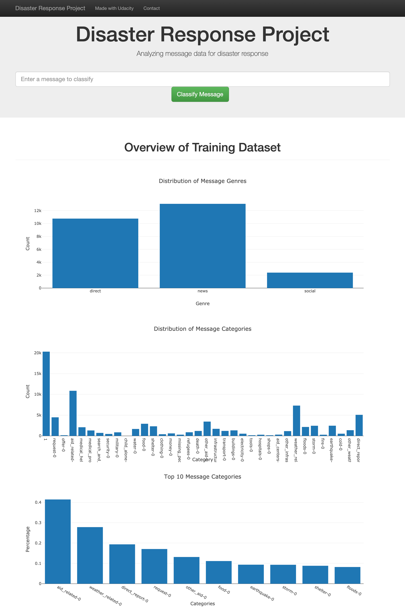
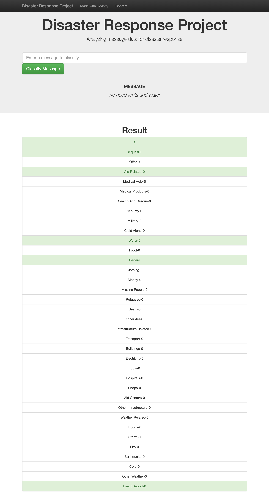

# Disaster Pipeline Project 

This project is for analyzing disaster data from Figure Eight to build a machine learning model and flask app that classifies disaster messages

## Example 1<h3> 




## Example 2 <h3> 

Example message for the classify and its result



## Instructions <h2> 

1. To install the requirements
```
pip install -r requirements.txt

```
2. To run ETL pipeline that cleans data and stores in database 

```
python data/process_data.py data/disaster_messages.csv data/disaster_categories.csv data/DisasterResponse.db

```
3. To run ML pipeline that trains classifier and saves as pkl file 
```
python models/train_classifier.py data/DisasterResponse.db models/classifier.pkl
```

4. Go to the app directory and run the command to flask app
```
python run.py

```
5. Go to the http://0.0.0.0:3001/

